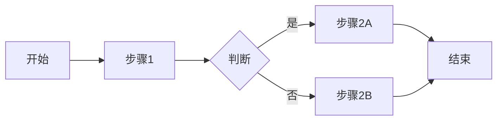

# 常见布局模式

本文档提供了商用 HTML 演示文稿中常见的页面布局模式和实现建议。

## 基础布局结构

所有页面共享的基础结构：

```
┌─────────────────────────────────────┐
│  Slide Header (80px)                │
│  - 标题 / Logo                       │
├─────────────────────────────────────┤
│                                     │
│  Slide Content (flex: 1)            │
│  - 主要内容区域                       │
│                                     │
└─────────────────────────────────────┘
```

## 1. 封面页 (Cover)

**用途：** 演示开始页、结束页、章节分隔页

**布局特点：**
- 全屏渐变背景
- 垂直居中对齐
- 无顶部标题栏（或仅显示 Logo）

**内容层级：**
```
┌─────────────────────────────────────┐
│                                     │
│         主标题 (64px)                │
│         副标题 (32px)                │
│                                     │
│         元信息                       │
│         (演讲人/日期/联系方式)         │
│                                     │
└─────────────────────────────────────┘
```

**CSS 关键样式：**
- `display: flex; flex-direction: column;`
- `justify-content: center; align-items: center;`
- `text-align: center;`
- `background: linear-gradient(...);`

## 2. 章节页 (Chapter)

**用途：** 内容分段，引导观众进入新主题

**布局特点：**
- 大号章节编号作为视觉锚点
- 居中对齐
- 简洁的描述文字

**内容层级：**
```
┌─────────────────────────────────────┐
│  Header: Logo                       │
├─────────────────────────────────────┤
│                                     │
│            01                       │
│         (章节编号, 120px, 透明)       │
│                                     │
│         章节标题 (56px)              │
│         章节描述 (24px)              │
│                                     │
└─────────────────────────────────────┘
```

**设计要点：**
- 章节编号使用大字体低透明度 (opacity: 0.2)
- 标题使用品牌主色
- 描述文字限制宽度 (max-width: 600px)

## 3. 左文右图 (Text-Image)

**用途：** 介绍产品、功能说明、案例展示

**布局特点：**
- 50/50 分栏
- 左侧文字说明
- 右侧配图或截图

**内容层级：**
```
┌─────────────────────────────────────┐
│  Header: 页面标题                    │
├──────────────────┬──────────────────┤
│                  │                  │
│  要点标题         │                  │
│  • 关键点 1       │     图片          │
│  • 关键点 2       │                  │
│  • 关键点 3       │                  │
│                  │                  │
└──────────────────┴──────────────────┘
```

**CSS 实现：**
```css
.content-grid {
    display: grid;
    grid-template-columns: 1fr 1fr;
    gap: 60px;
    align-items: center;
}
```

**变体：**
- 右文左图 (调整列顺序)
- 30/70 或 70/30 分配（调整 grid-template-columns）

## 4. 纯文本页 (Text-Only)

**用途：** 关键观点阐述、引用、总结

**布局特点：**
- 单列布局
- 大字体
- 充足留白

**内容层级：**
```
┌─────────────────────────────────────┐
│  Header: 页面标题                    │
├─────────────────────────────────────┤
│                                     │
│     主要内容标题                     │
│                                     │
│     • 要点 1                        │
│     • 要点 2                        │
│     • 要点 3                        │
│     • 要点 4                        │
│                                     │
└─────────────────────────────────────┘
```

**设计要点：**
- 内容居中或左对齐
- 列表项使用自定义标记
- 最大宽度限制 (max-width: 900px)

## 5. 双栏对比 (Two-Column Comparison)

**用途：** 对比方案、前后对比、优劣分析

**布局特点：**
- 对称的两栏布局
- 明确的分隔线或背景区分

**内容层级：**
```
┌─────────────────────────────────────┐
│  Header: 对比标题                    │
├──────────────────┬──────────────────┤
│                  │                  │
│   选项 A          │    选项 B         │
│                  │                  │
│   • 特点 1        │    • 特点 1       │
│   • 特点 2        │    • 特点 2       │
│   • 特点 3        │    • 特点 3       │
│                  │                  │
└──────────────────┴──────────────────┘
```

**CSS 实现：**
```css
.comparison-grid {
    display: grid;
    grid-template-columns: 1fr 1fr;
    gap: 40px;
}

.comparison-column {
    padding: 40px;
    background: #f8f9fa;
    border-radius: 8px;
}
```

## 6. 数据图表页 (Chart)

**用途：** 数据展示、趋势分析、统计结果

**布局特点：**
- 图表占据主要空间
- 简短的标题和说明

**内容层级：**
```
┌─────────────────────────────────────┐
│  Header: 数据标题                    │
├─────────────────────────────────────┤
│                                     │
│                                     │
│          ECharts 图表               │
│          (占据 70-80% 高度)          │
│                                     │
│                                     │
│  数据说明或关键洞察 (可选)            │
└─────────────────────────────────────┘
```

**ECharts 集成：**
```javascript
const chart = echarts.init(document.getElementById('chart-1'));
chart.setOption({
    // 配置选项
});
```

**图表类型选择：**
- 柱状图：类别对比
- 折线图：时间序列
- 饼图：占比构成
- 散点图：相关性分析

## 7. 流程图页 (Diagram)

**用途：** 流程说明、系统架构、关系图

**布局特点：**
- 图表居中显示
- 充足的空间展示复杂关系

**内容层级：**
```
┌─────────────────────────────────────┐
│  Header: 流程标题                    │
├─────────────────────────────────────┤
│                                     │
│                                     │
│        Mermaid 流程图               │
│                                     │
│                                     │
└─────────────────────────────────────┘
```

**Mermaid 语法示例：**


## 8. 多媒体页 (Media)

**用途：** 视频演示、产品 Demo

**布局特点：**
- 视频或媒体居中
- 控制栏和标题清晰可见

**内容层级：**
```
┌─────────────────────────────────────┐
│  Header: 媒体标题                    │
├─────────────────────────────────────┤
│                                     │
│                                     │
│        Video Player                 │
│        (16:9 比例)                   │
│                                     │
│        视频说明文字                  │
│                                     │
└─────────────────────────────────────┘
```

**视频最佳实践：**
- 支持 controls 属性
- 宽度 70-80% 容器
- 添加说明文字
- 考虑自动播放策略

## 9. 网格展示 (Grid)

**用途：** 多个案例、产品列表、团队介绍

**布局特点：**
- 2x2 或 3x2 网格
- 每个单元格包含图片和文字

**内容层级：**
```
┌─────────────────────────────────────┐
│  Header: 列表标题                    │
├────────┬────────┬────────┬─────────┤
│ [图片]  │ [图片]  │ [图片]  │ [图片]  │
│  说明   │  说明   │  说明   │  说明   │
├────────┼────────┼────────┼─────────┤
│ [图片]  │ [图片]  │ [图片]  │ [图片]  │
│  说明   │  说明   │  说明   │  说明   │
└────────┴────────┴────────┴─────────┘
```

**CSS 实现：**
```css
.grid-layout {
    display: grid;
    grid-template-columns: repeat(4, 1fr);
    gap: 30px;
}
```

## 10. 时间线 (Timeline)

**用途：** 发展历程、项目进度、路线图

**布局特点：**
- 水平或垂直时间轴
- 节点标注关键事件

**内容层级：**
```
┌─────────────────────────────────────┐
│  Header: 时间线标题                  │
├─────────────────────────────────────┤
│                                     │
│  ①────②────③────④────⑤             │
│  │    │    │    │    │             │
│  2020 2021 2022 2023 2024          │
│  事件1 事件2 事件3 事件4 事件5        │
│                                     │
└─────────────────────────────────────┘
```

## 响应式适配

### 大屏幕 (>1920px)

- 保持固定最大宽度
- 增加左右边距
- 放大字体和间距

### 标准屏幕 (1920x1080, 1280x720)

- 默认布局
- 标准字体大小

### 小屏幕 (<1024px)

- 双栏变单栏
- 减小字体
- 减少边距
- 触摸友好按钮

## 布局选择决策树

```
是否需要展示数据？
├─ 是 → 图表页
└─ 否 → 是否有图片/视频？
    ├─ 是 → 是否是主要内容？
    │   ├─ 是 → 多媒体页
    │   └─ 否 → 左文右图
    └─ 否 → 是否需要对比？
        ├─ 是 → 双栏对比
        └─ 否 → 纯文本页
```

## 常见问题

**Q: 如何决定每页内容量？**
A: 遵循 "一页一个观点" 原则，每页 3-5 个要点，避免信息过载。

**Q: 图片应该多大？**
A: 最小 1920x1080，保持 16:9 或 4:3 比例，文件大小控制在 500KB 以内。

**Q: 如何处理长列表？**
A: 考虑分页展示，或使用滚动区域，避免单页超过 7-9 项。

**Q: 动画效果是否必要？**
A: 商务演示建议使用简单的淡入淡出，避免复杂动画影响专业性。
